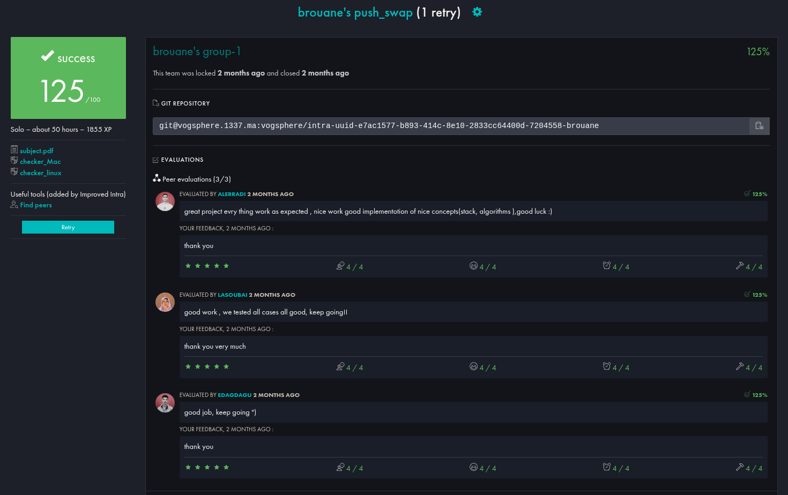

<div align="center">

```
██████╗ ██╗   ██╗███████╗██╗  ██╗    ███████╗██╗    ██╗ █████╗ ██████╗ 
██╔══██╗██║   ██║██╔════╝██║  ██║    ██╔════╝██║    ██║██╔══██╗██╔══██╗
██████╔╝██║   ██║███████╗███████║    ███████╗██║ █╗ ██║███████║██████╔╝
██╔═══╝ ██║   ██║╚════██║██╔══██║    ╚════██║██║███╗██║██╔══██║██╔═══╝ 
██║     ╚██████╔╝███████║██║  ██║    ███████║╚███╔███╔╝██║  ██║██║     
╚═╝      ╚═════╝ ╚══════╝╚═╝  ╚═╝   ╚══════╝ ╚══╝╚══╝ ╚═╝  ╚═╝╚═╝     
```

*A 42 curriculum project — sort integers with two stacks and a restricted instruction set.*


</div>

---

## 📖 Project grade screenshot



## 📖 What is push_swap?

**push_swap** is an algorithmic sorting challenge from the 42 curriculum. The rules are simple but brutal:

- You have **two stacks**: `A` and `B`
- Stack `A` starts loaded with integers in random order
- Stack `B` starts empty
- You must sort stack `A` in ascending order using **only a fixed set of operations**
- **The fewer operations, the better**

This project builds deep intuition around sorting algorithms, indexed data structures, chunk-based optimization, and tight memory management — all in C.

---

## ⚙️ Operations

| Operation | Effect |
|-----------|--------|
| `sa` | Swap the top 2 elements of stack A |
| `sb` | Swap the top 2 elements of stack B |
| `ss` | `sa` + `sb` simultaneously |
| `pa` | Push top of B → top of A |
| `pb` | Push top of A → top of B |
| `ra` | Rotate A upward (top → bottom) |
| `rb` | Rotate B upward (top → bottom) |
| `rr` | `ra` + `rb` simultaneously |
| `rra` | Reverse rotate A (bottom → top) |
| `rrb` | Reverse rotate B (bottom → top) |
| `rrr` | `rra` + `rrb` simultaneously |

---

## 🚀 Getting Started

### Compilation

```bash
make          # build push_swap
make bonus    # build checker (bonus)
make clean    # remove object files
make fclean   # full cleanup
make re       # recompile from scratch
```

### Running push_swap

```bash
./push_swap 4 67 3 87 23
./push_swap "4 67 3 87 23"
./push_swap "4 67 3 87 23" -95 -651
```

The program prints the sequence of operations to stdout, one per line.

### Running the Checker (Bonus)

Pipe push_swap output into the checker to verify correctness:

```bash
./push_swap 3 2 1 | ./checker 3 2 1
# OK

./push_swap 3 2 1 | ./checker 3 2 1
# KO  (if something went wrong)

./checker 3 2 1
# Type instructions manually, then Ctrl+D
```

---

## 🧠 Sorting Strategy

The algorithm dynamically selects the best strategy based on input size to minimize operation count.

```
Input size → Strategy selected
─────────────────────────────────────────────────────────
   n = 1   →  already sorted, do nothing
   n = 2   →  single ra if out of order
   n = 3   →  case-based sort (all permutations, ≤ 3 ops)
  n ≤ 5    →  push n-3 elements to B, sort 3 in A, reinsert
  n > 5    →  chunk-based sort (see below)
─────────────────────────────────────────────────────────
```

### Chunk-based Sort (n > 5)

This is the core algorithm for large inputs:

**Phase 1 — Push to B in chunks:**
```
Stack A (unsorted)                Stack B (empty)
┌───┐                             ┌───┐
│ ? │  ──► index fits chunk? ──►  │   │
│ ? │         pb / rb             │   │
│ ? │                             │   │
└───┘                             └───┘

Chunk size: 5  (n ≤ 10)
            16 (n ≤ 100)
            32 (n > 100)
```

Elements are pushed into B in indexed ranges. Elements landing in the current chunk's lower half are rotated to the bottom of B, keeping higher-indexed elements near the top. This pre-sorts B in reverse order.

**Phase 2 — Push back to A in descending index order:**
```
Stack B (reverse-sorted)          Stack A (sorted result)
┌───┐                             ┌───┐
│max│  ──►  pa  ──────────────►   │ 0 │
│...│   (rotate B to find max)    │ 1 │
│   │                             │ 2 │
└───┘                             │...│
                                  └───┘
```

For each step, the algorithm decides whether to use `rb` or `rrb` based on which direction requires fewer rotations (position vs. `len / 2`).

---

## 📁 Project Structure

```
push_swap/
│
├── Makefile               # Build rules for push_swap and checker (bonus)
├── push_swap.h            # Structs (t_stack_node, t_data) & all prototypes
├── push_swap.c            # Entry point & main sorting pipeline
│
├── error_checker.c        # Input validation (digits, signs, duplicates, overflow)
├── extended_functions.c   # Stack assignment, data initialization
├── external_functions.c   # ft_strlen, ft_count_words, find_index
├── internal_functions.c   # Argument parsing, array allocation, sort + copy
├── freedom.c              # All memory cleanup / free functions
├── ft_atoi.c              # String → int with overflow protection
├── ft_lstadd_back.c       # Stack node creation & append
├── ft_print.c             # Write operation name to stdout
├── split_them.c           # Argument string splitting
│
├── operations_manager.c   # Strategy dispatcher (2 / 3 / 5 / chunk)
├── three_sorter.c         # Optimized 3-element sort (all permutations)
├── push_from_a.c          # 5-element sort: push n-3 from A → B
├── push_to_b.c            # Chunk sort: distribute A → B by index range
├── push_back_to_a.c       # Chunk sort: reinsert B → A in descending order
│
├── push.c                 # pa / pb
├── rotate.c               # ra / rb / rr
├── reverse_rotate.c       # rra / rrb / rrr
├── swap.c                 # sa / sb / ss
│
├── checker.h              # Includes push_swap.h + get_next_line.h, declares ft_strcmp
├── checker.c              # Bonus: reads ops from stdin, executes them, prints OK/KO
├── checker_utils.c        # ft_strcmp — matches instruction strings
├── get_next_line.h        # GNL header (BUFFER_SIZE, prototypes)
├── get_next_line.c        # Line-by-line stdin reader
└── get_next_line_utils.c  # ft_strchr, ft_strjoin, ft_strjoin_copy
```
---

## File & Function Documentation

---

### `error_checker.c`

Handles **input validation and error detection**.

* `ft_isdigit(char d)`
  Checks whether a character is a digit.

* `ft_issign(char s)`
  Checks if a character is a sign (`+` or `-`).

* `dig_sign_checker(char *str)`
  Verifies correct numeric format and valid sign placement.

* `dup_errors(int count, long *original_numbers)`
  Detects duplicate numbers.

* `check_for_errors(char ***array, long **original_numbers, int count)`
  Global input validation: checks formatting, conversion errors, and duplicates.

---

### `extended_functions.c`

Utility functions extending core logic.

* `assign_to_stack(...)`
  Builds stack A by assigning each value its sorted index.

* `initialize_data(...)`
  Handles argument parsing, allocation, and validation. Shared by both push_swap and checker.

---

### `external_functions.c`

General helper functions.

* `ft_count_words(...)`
  Counts words separated by a delimiter.

* `find_index(...)`
  Finds the index of a value in the sorted array.

* `ft_strlen(...)`
  Computes string length.

---

### `freedom.c`

Handles **memory management and cleanup**.

* `free_array(...)`
  Frees a 2D character array.

* `free_pointers(...)`
  Frees all allocated arrays.

* `free_stack(...)`
  Frees a stack.

* `free_all_stacks(...)`
  Frees both stacks.

---

### `ft_atoi.c`

* `ft_atoi(...)`
  Converts string to integer with overflow protection.

---

### `ft_lstadd_back.c`

Stack construction utilities.

* `ft_lstnew(...)`
  Creates a new stack node.

* `ft_lstadd_back(...)`
  Appends a node to the stack.

---

### `ft_print.c`

* `ft_print(char *str)`
  Outputs operations to stdout.

---

### `internal_functions.c`

Core input and preprocessing logic.

* `count_all_nums(...)`
  Counts total numbers from input.

* `array_manager(...)`
  Builds argument array.

* `numbers_manager(...)`
  Allocates numeric arrays.

* `numbers_copy(...)`
  Copies original → sorted array.

* `sort_numbers(...)`
  Sorts numeric array and detects sorted input.

---

### `operations_manager.c`

Controls **sorting strategy selection**.

* `two_sorter(...)`
  Sorts 2 elements.

* `five_sorter(...)`
  Sorts up to 5 elements.

* `chunk_sorter(...)`
  Handles large input using chunk-based logic.

* `operations_manager(...)`
  Chooses best strategy based on input size.

---

### `push_back_to_a.c`

Handles **reinsertion from stack B → A**.

* `which_position(...)`
  Locates a target index in stack.

* `push_using_rb(...)`
  Push using forward rotation.

* `push_using_rrb(...)`
  Push using reverse rotation.

* `push_back_to_a(...)`
  Main reinsertion algorithm.

---

### `push.c`

Stack push operations.

* `push(...)`
  Core push operation.

* `pb(...)`
  Push from A → B.

* `pa(...)`
  Push from B → A.

---

### `push_from_a.c`

Handles **initial distribution from A → B**.

* `which_position_in_a(...)`
  Locates element position in stack A.

* `push_using_ra(...)`
  Forward rotation push.

* `push_using_rra(...)`
  Reverse rotation push.

* `push_from_a(...)`
  Main extraction algorithm.

---

### `push_to_b.c`

Chunk-based sorting logic.

* `set_max_range(...)`
  Determines chunk size.

* `push_to_b(...)`
  Pushes elements into B using chunk strategy.

---

### `rotate.c`

Rotation operations.

* `rotate(...)`
  Core rotate logic.

* `ra(...)`
  Rotate A.

* `rb(...)`
  Rotate B.

* `rr(...)`
  Simultaneously rotates both A and B.

---

### `reverse_rotate.c`

Reverse rotation operations.

* `reverse_rotate(...)`
  Core reverse rotation logic.

* `rra(...)`
  Reverse rotate A.

* `rrb(...)`
  Reverse rotate B.

* `rrr(...)`
  Simultaneously reverse rotates both A and B.

---

### `swap.c`

Swap operations.

* `swap(...)`
  Core swap logic.

* `sa(...)`
  Swap A.

* `sb(...)`
  Swap B.

* `ss(...)`
  Simultaneously swaps both A and B.

---

### `split_them.c`

Argument splitting.

* `ft_putword(...)`
  Copies extracted word.

* `ft_split_words(...)`
  Splits string into words.

* `split_them(...)`
  Main argument splitter.

---

### `three_sorter.c`

Optimized sorting for **exactly 3 elements**.

* `three_sorter_cases(...)`
  Contains all sorting permutations.

* `three_sorter(...)`
  Applies correct sorting case.

---

### `push_swap.c`

Main program control.

* `initialize_data(...)`
  Handles argument parsing, allocation, and validation.

* `push_swap(...)`
  Main sorting pipeline.

* `main(...)`
  Program entry point.

---

## Bonus — Checker Files

---

### `checker.c`

Bonus checker main program.

* `is_sorted_stack(...)`
  Checks whether stack A is fully sorted by index.

* `exec_instruction(...)`
  Reads a single instruction string and executes the matching stack operation.

* `read_and_execute(...)`
  Reads all instructions from stdin line by line using get_next_line and executes each one.

* `checker(...)`
  Main checker pipeline: initializes data, reads and executes instructions, then outputs OK or KO.

* `main(...)`
  Checker program entry point.

---

### `checker_utils.c`

Utility functions for the checker.

* `ft_strcmp(...)`
  Compares two strings. Used to match instruction names read from stdin.

---

### `get_next_line.c`

Reads input line by line from a file descriptor.

* `next_line(...)`
  Extracts the next line from the working buffer.

* `read_line(...)`
  Reads from the file descriptor into the working buffer until a newline is found.

* `new_line(...)`
  Trims the already-extracted line from the working buffer.

* `get_next_line(...)`
  Main function: returns the next line from the given file descriptor.

---

### `get_next_line_utils.c`

Helper functions for get_next_line.

* `ft_strchr(...)`
  Checks whether the working buffer contains a newline character.

* `ft_strjoin_copy(...)`
  Copies two strings into a pre-allocated joined buffer.

* `ft_strjoin(...)`
  Concatenates two strings into a newly allocated string.

---
---

## 🔄 Program Flow

```
main()
  └─► push_swap()
        │
        ├─► initialize_data()
        │     ├── count_all_nums()      count total integers
        │     ├── array_manager()       build string array from argv
        │     ├── numbers_manager()     malloc original + sorted arrays
        │     ├── check_for_errors()
        │     │     ├── dig_sign_checker()   valid characters?
        │     │     ├── ft_atoi()            in INT range?
        │     │     └── dup_errors()         no duplicates?
        │     └── numbers_copy()        copy originals → sorted array
        │
        ├─► sort_numbers()              bubble sort the sorted[] array
        │     └── (returns 1 if already sorted → skip operations)
        │
        ├─► assign_to_stack()           build stack_a with index per value
        │
        └─► operations_manager()
              ├── n=2  → two_sorter()
              ├── n=3  → three_sorter()
              ├── n≤5  → five_sorter()
              │             ├── push_from_a()
              │             ├── three_sorter()
              │             └── push_back_to_a()
              └── n>5  → chunk_sorter()
                            ├── push_to_b()
                            └── push_back_to_a()
```

---

## 🛠️ Error Handling

The program prints `Error` to stdout and exits cleanly for any of the following:

- Non-numeric characters in input
- Sign not at start of number, or sign alone
- Integer overflow (value outside `INT_MIN` / `INT_MAX`)
- Duplicate values
- Empty argument strings

---

## 📊 Performance Targets

| Input size | Target operations |
|------------|------------------|
| 3 elements | ≤ 3 ops |
| 5 elements | ≤ 12 ops |
| 100 elements | < 700 ops |
| 500 elements | < 5500 ops |

---

## 🔗 Resources

| Resource | Link |
|----------|------|
| 42 Cursus Guide | [push_swap chapter](https://42-cursus.gitbook.io/guide/2-rank-02/push_swap) |
| Push Swap Visualizer | [visualizer](https://push-swap42-visualizer.vercel.app/) |
| Algorithm Walkthrough | [YouTube](https://www.youtube.com/watch?v=OaG81sDEpVk) |
| Linked Lists Explained | [YouTube](https://www.youtube.com/watch?v=uBZHMkpsTfg) |

---

## 📝 Notes on AI Usage

AI tools were used during development for:
- Debugging memory errors and segmentation faults
- Brainstorming algorithmic optimizations
- Improving documentation clarity

All algorithm design, logic implementation, and decisions were fully understood and owned by the author.

---

<div align="center">

*Made with frustration and coffee as part of the 42 curriculum.*

</div>
